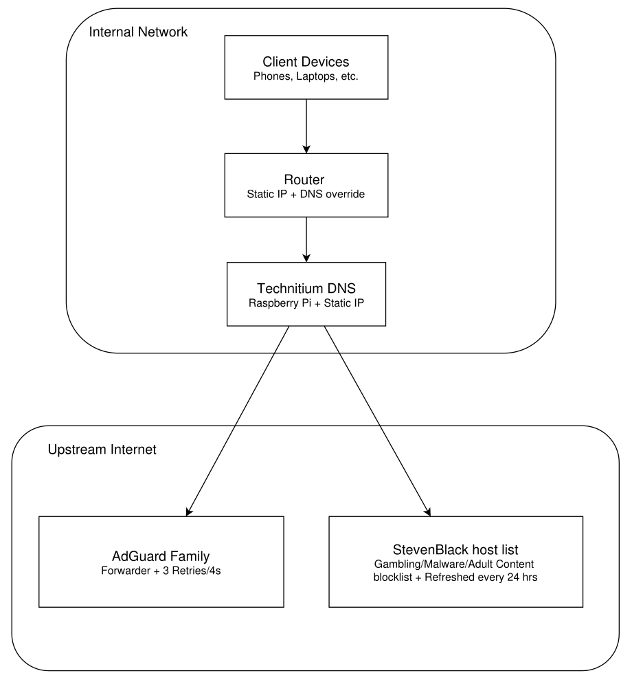

# Technitium DNS Server

Self-hosted DNS infrastructure for a home network, deployed as part of an ongoing homelab project.

## Overview

This project documents my Technitium DNS Server deployment as part of a self-hosted homelab. It's used for internal/external name resolution and DNS-layer threat filtering across my home network.

## What is Technitium

Technitium is a free, open-source DNS server software that runs on Windows, Linux, macOS, and ARM devices like a Raspberry Pi — it can act as both an authoritative DNS server (hosting your own zones) and a recursive resolver with built-in features like ad/malware blocking, DNS-over-HTTPS/TLS, and split-horizon DNS. 

## Project Architecture

 

## What's Running

I currently have a Technitium DNS Server running on a Raspberry Pi, handling internal DNS queries for personal servers on my network (with future devices to be added), and forwarding all unknown/external DNS traffic to a specified upstream forwarder — AdGuard Family Public DNS — which blocks ads, malware, gambling, and adult content.

| Component | Platform | Purpose |
|---|---|---|
| Technitium DNS | Raspberry Pi | Internal DNS resolution + query forwarding |
| Router | Home network router | Assigns static IP to the Pi, redirects client DNS to it |
| Forwarder | AdGuard Family Public DNS | Handles unresolved/external queries, blocks ads, malware, gambling, & adult content |

## Key Features Implemented

Current configuration on the Raspberry Pi:

**Query logging**
- Logs are retained for 180 days locally on the Raspberry Pi, tracking query failures for troubleshooting.

**DNS forwarding (DNS-over-HTTPS)**
- Forwarder set to `https://family.adguard-dns.com/dns-query` using DNS over HTTPS (DoH) for encrypted queries.
- Blocks ads, malware, and adult content at the forwarder level.
- Currently the only configured forwarder — 3 failure retries, at 4-second intervals.

**Domain blocking**
- Blocked domains return an NXDOMAIN response.
- Blocked responses are cached for 30 seconds before clearing.

**Blocklist subscription**
- Source: [StevenBlack/hosts — gambling-porn list](https://raw.githubusercontent.com/StevenBlack/hosts/master/alternates/gambling-porn/hosts)
- Covers malware, gambling, adware, and adult content domains.
- No custom domains blocked manually yet — relying entirely on the subscribed list.
- List auto-updates every 24 hours.

## Setup Walkthrough

*Coming soon — step-by-step configuration notes and screenshots will be added here.*

## Planned Improvements

- [ ] Deploy a Proxmox host running multiple VMs (Domain Controller, containerized apps for media/file serving). DNS zones will be structured strategically ahead of time so scaling to these new devices stays easy to maintain.
- [ ] Script to forward DNS logs to an external VM on the Proxmox host for centralized logging.
- [ ] Custom "domain blocked" landing page — shown when a client hits a blocked domain, stating who to contact to unblock or temporarily allow it.

## What I Learned So Far

- **Static IP addressing** — why a static IP matters for a DNS server specifically: a dynamic IP eventually changes once its DHCP lease expires, breaking resolution for any client still pointed at the old address.
- **DNS forwarding** — how forwarding unresolved internal queries to a public DNS server prevents "could not resolve domain" errors for anything outside the local network.
- **DNS over HTTPS (DoH)** — how to encrypt DNS queries in transit for better privacy.
- **DNS-based blocklists** — how subscribing to a blocklist protects clients from malware, adware, gambling, and adult content, meaningfully improving network-wide security.
